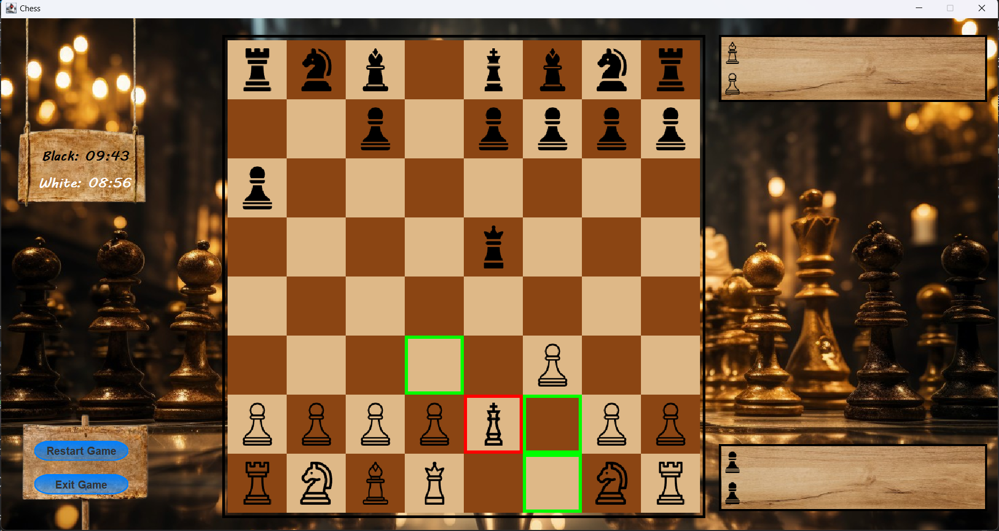

# Chess Game

  

A 1v1 interactive chess game built with Java and Java Swing, featuring a user-friendly graphical interface, robust move validation, and special chess mechanics like check and checkmate detection. This project demonstrates object-oriented programming (OOP), SOLID principles, and efficient algorithms for game state management and move generation, developed as a collaborative effort to create a scalable and maintainable chess application.

## Screenshots

### Gameplay Interface

*The main gameplay screen with timers, highlighted moves, and restart/exit options.*

### Main Menu

*The main menu with options for 1-player, 2-player, online (future), and exit.*

## Table of Contents

- [Features](#features)
- [Future Features](#future-features)
- [Algorithms](#algorithms)
- [Prerequisites](#prerequisites)
- [Installation](#installation)
- [Running the Game](#running-the-game)
- [Contributing](#contributing)
- [License](#license)
- [Acknowledgments](#acknowledgments)

## Features

- **Interactive 1v1 Gameplay**: Play chess against another player on the same device with a click-to-move interface (highlighted squares indicate valid moves).
- **Graphical User Interface**: Built with Java Swing, featuring a wooden-themed chessboard, timers, and intuitive controls like "Restart Game" and "Exit Game" buttons.
- **Timer System**: Set custom game timers for each player (in minutes) via a pop-up dialog before starting the game.
- **Move Validation**: Ensures all moves adhere to standard chess rules, including special moves like castling, en passant, and pawn promotion.
- **Game State Detection**: Implements check, checkmate, and stalemate detection for accurate game outcomes.
- **Visual Feedback**: Highlights valid moves (green outline) and pieces in check (red outline) for better user experience.
- **Optimized Performance**: Efficient algorithms reduce response times during gameplay for a smooth experience.
- **Main Menu**: Choose between 1-player (future), 2-player, online (future), or exit the game.

## Future Features

- **Vs. Computer Mode with AI**: Currently not implemented, but planned for a future release to allow players to compete against an AI opponent.
- **Online Multiplayer**: Planned for a future release to enable online play between remote players.

## Algorithms

The chess game leverages several algorithms to manage gameplay and ensure correctness:

- **Move Generation and Validation**:
  - **Legal Move Generator**: Iterates through each piece’s possible moves, checking board boundaries and piece-specific rules (e.g., knight L-shape, bishop diagonals).
  - **Special Move Handling**: Implements logic for castling (king/rook positioning, no check), en passant (pawn capture conditions), and pawn promotion (user choice of queen, rook, bishop, or knight).
  - **Algorithm**: Uses a rule-based approach with piece-specific move templates stored in objects, validated against the current board state.

- **Game State Management**:
  - **Board Representation**: Utilizes an 8x8 2D array or object-based structure to track piece positions.
  - **State Tracking**: Maintains game state (e.g., whose turn, castling availability, half-move clock) to comply with FIDE rules.
  - **Algorithm**: Employs a state machine to transition between player turns and detect game-ending conditions.

- **Check and Checkmate Detection**:
  - **Check Detection**: Scans for threats to the king by simulating opponent moves, highlighting the king in red when in check.
  - **Checkmate/Stalemate**: Evaluates all legal moves for the king to determine if escape is possible or if the game is drawn.
  - **Algorithm**: Depth-first search over legal moves with early termination for performance.

- **Timer Management**:
  - **Countdown Logic**: Tracks time for each player, updating the UI every second.
  - **Algorithm**: Uses Java’s `Timer` or `Thread` to manage countdowns, pausing when a player’s turn ends.

- **Performance Optimization**:
  - **Event-Driven Updates**: Uses Swing’s event listeners to update the GUI only when necessary, minimizing redraws.
  - **Move Highlighting**: Precomputes valid moves for the selected piece and highlights them in green for quick feedback.

## Prerequisites

- **Java Development Kit (JDK)**: Version 17 or higher.
- **Maven**: For dependency management (if used).
- **IDE**: IntelliJ IDEA, Eclipse, or VS Code with Java extensions (optional but recommended).
- **Git**: To clone the repository.

## Installation

1. **Clone the Repository**:
   ```bash
   git clone https://github.com/MostafaAbdulazziz/Chess.git
   cd Chess
   ```

2. **Set Up Dependencies**:
   - If using Maven:
     ```bash
     mvn clean install
     ```
   - If no build tool, ensure JDK is configured and Swing libraries are available (included in standard Java).

3. **Verify Java Version**:
   ```bash
   java -version
   ```
   Ensure output shows Java 17 or higher.

## Running the Game

1. **Compile the Project**:
   - With Maven:
     ```bash
     mvn compile
     ```
   - Without Maven:
     ```bash
     javac -d bin src/main/java/chess/*.java
     ```

2. **Run the Game**:
   - With Maven:
     ```bash
     mvn exec:java -Dexec.mainClass="chess.Main"
     ```
   - Without Maven:
     ```bash
     java -cp bin chess.Main
     ```

3. **Play the Game**:
   - The main menu opens with options: "1 Player" (future), "2 Players", "Online" (future), and "Exit".
   - Select "2 Players" to start a game.
   - A dialog prompts to set the timer (in minutes) for each player; click "OK" to proceed.
   - The game window opens, displaying an 8x8 chessboard with timers for Black and White.
   - Players take turns by clicking a piece to highlight valid moves (green outline) and clicking a highlighted square to move.
   - If a king is in check, it is highlighted in red.
   - Use the "Restart Game" button to start a new game or "Exit Game" to return to the main menu.
   - The game ends with a message for checkmate, stalemate, or resignation (if implemented).

## Contributing

We welcome contributions to enhance the chess game! To contribute:

1. Fork the repository.
2. Create a new branch (`git checkout -b feature/your-feature`).
3. Make your changes and commit (`git commit -m "Add your feature"`).
4. Push to your branch (`git push origin feature/your-feature`).
5. Open a pull request with a clear description of your changes.

Please follow the [Code of Conduct](CODE_OF_CONDUCT.md) and ensure tests (if any) pass.

## License

This project is licensed under the [MIT License](LICENSE).

## Acknowledgments

- Developed as a team project by Mostafa Abdul Aziz and Mohamed Nour Eldin.
- Inspired by classic chess implementations and Java Swing tutorials.
- Thanks to the open-source community for tools and libraries.
